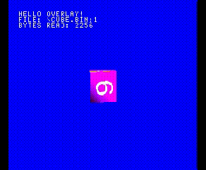

# Ovl-upload : On-demand Overlay uploading on the PSX



This example code demonstrates how to use the companion 'ovl-upload.py' script that should be provided with this file.

Once the code is loaded on a unirom enabled PSX via a serial/USB cable, 'ovl-upload.py' listens for a specific command

to load an overlay file on demand. 

For an explanation about overlays, see [http://psx.arthus.net/sdk/Psy-Q/DOCS/TRAINING/FALL96/overlay.pdf](http://psx.arthus.net/sdk/Psy-Q/DOCS/TRAINING/FALL96/overlay.pdf)

For a basic example see @JaberwockySeamonstah's [https://github.com/JaberwockySeamonstah/PSXOverlayExample](https://github.com/JaberwockySeamonstah/PSXOverlayExample)

# Thanks 

@JaberwockySeamonstah, @JonathanDotCel, @nicolasnoble, @Lameguy64 for their help and patience.

## Set-up

* You need to set up the Nugget+PsyQ SDK, as described here : [https://github.com/ABelliqueux/nolibgs_hello_worlds](https://github.com/ABelliqueux/nolibgs_hello_worlds)
* Clone this repo.
* Get [Unirom](https://github.com/JonathanDotCel/unirom8_bootdisc_and_firmware_for_ps1/) + [NotPSXserial](https://github.com/JonathanDotCel/NOTPSXSerial).
* Get [mkpsxiso](https://github.com/Lameguy64/mkpsxiso).
* With your PSX on at the unirom prompt, serial/USB cable plugged, upload the default data at the right address : 
  
```bash
# We need debug mode for runtime data uploading

nops /debug /dev/ttyUSB0

nops /fast /bin 0x8003e5c8 Overlay.ovl0

nops /fast /exe ovl-upload.ps-exe

nops /slow
```

You should see a cube on a blue background.

* In a terminal/cmd, launch the python script `./ovl-upload.py`. You should see a message : `Listening for incoming data...`

* Push the **select** button on your controller. The cube should change shape ! In reality, we are loading the geometry data from another file : `Overlay.ovl1`

Alternativly, you can use the bin/cue in an emulator or xstation.

Helper scripts are provided for convenience and are dependent on `pcsx-redux` and `mkpsxiso` being in your $PATH.

* `isotest.sh` will make, build the bin/cue, and open the resulting image in pcsx-redux.
* `ovly-upload-helper.sh` is a small wrapper for `nops`, hence depending on it being in your $PATH that takes args : load address,
overlay filename, ps-exe filename and optional comport/serialdevice - e.g : 

```bash
# make &&
./ovly-upload-helper.sh 0x8003e5c8 Overlay.ovl0 ovl-upload.ps-exe /dev/ttyUSB0
```
